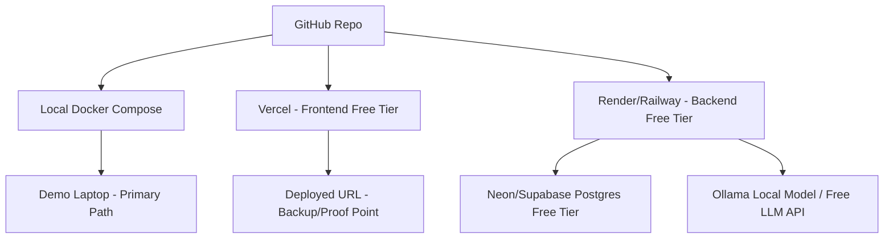
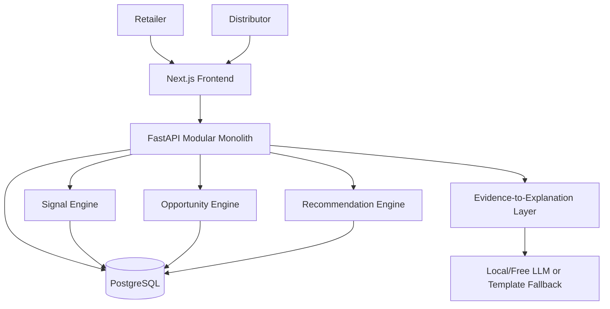
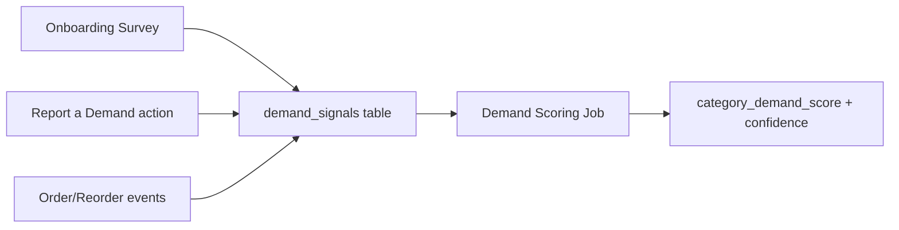
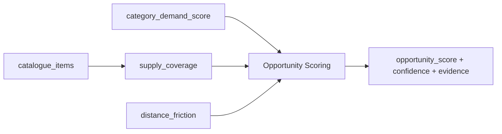
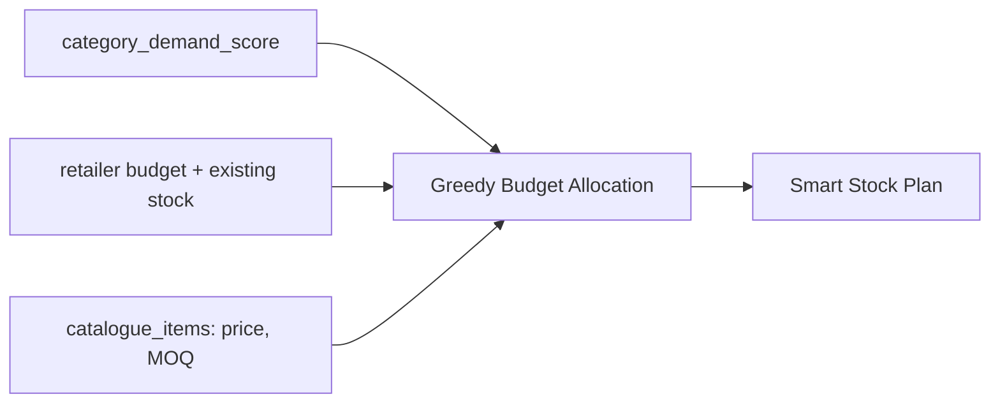
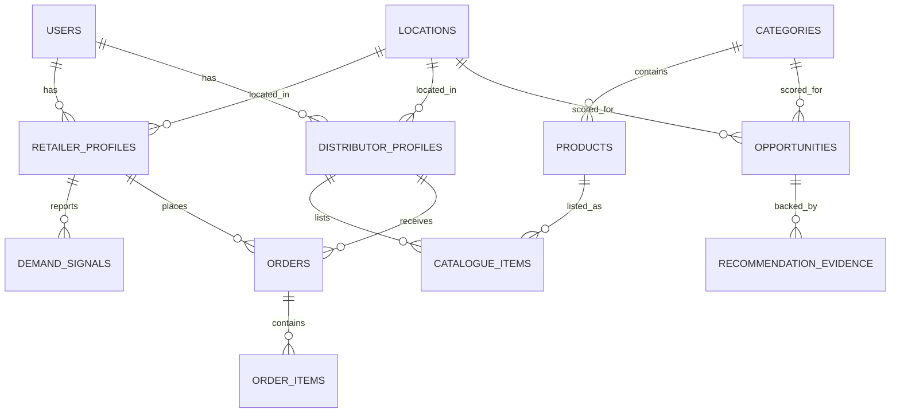

# SANKET — LOCAL BUSINESS INTELLIGENCE FOR RURAL COMMERCE
### MVP Product & Technical Blueprint (₹0 Budget, Hackathon-Ready)

> **सiगnal se decision, decision se growth.**
> *Sanket* (संकेत) = "signal / indication." The product's entire job is to turn scattered local signals — what retailers say they need, what's actually being supplied nearby — into one clear, explainable signal a business owner can act on.

---

## 1. Executive Summary

Sanket is a hyper-local business intelligence engine for rural and semi-urban B2B commerce. It does **not** try to be a marketplace, a lending platform, a chatbot, a logistics network, and a demand forecaster all at once. It does one thing extremely well:

> **It turns fragmented local demand and supply signals into an explainable business decision — "what should I stock" for a retailer, and "what should I supply" for a distributor — with every number traceable to evidence.**

Ordering, catalogues, and government-scheme discovery exist in the MVP, but only as **thin support layers** around the intelligence core, not as the product's center of gravity. Everything in this document is buildable by a 5-person student team in 14 days for approximately ₹0, using open-source software and free tiers only, and is designed to survive tough technical cross-examination from judges.

---

## 2. The Problem

Rural and small-town retailers and distributors make stocking and expansion decisions almost entirely on gut feel and word-of-mouth. There is no visibility into:

- What nearby customers are actually asking for but not finding.
- Which categories are under-supplied in a given service area.
- Whether a new product line is worth the risk before committing scarce working capital.

Existing platforms (IndiaMART-style directories, general marketplaces, WhatsApp groups) solve **discovery and transaction** — "who sells X" — but none of them answer **"what should I sell, and why do you think so?"** That gap, not the absence of another ordering app, is the real problem.

---

## 3. Existing Gap

| What exists today | What it gives a retailer/distributor | What it does NOT give them |
|---|---|---|
| Local distributor relationships | Trust, credit terms | Visibility beyond their own area |
| WhatsApp/word of mouth | Ad-hoc demand hints | No aggregation, no scoring, no memory |
| IndiaMART / general marketplaces | Product search, supplier listing | No local demand signal, no "why," no explanation |
| Government scheme portals | Static scheme text | No personalized eligibility guidance, no connection to actual business decisions |
| Generic AI chatbots | Conversational answers | No grounding in real local data — high hallucination risk for financial/eligibility claims |

Sanket's gap-filling role: **aggregation + scoring + explanation**, sitting on top of (not replacing) the relationships and channels that already exist.

---

## 4. Product Thesis

> Most platforms help businesses **transact**. Sanket helps them **decide** — and shows its work.

Three design commitments follow directly from this thesis and run through the whole document:

1. **The system calculates. The AI explains.** No score, quantity, or ranking is ever produced by an LLM.
2. **Every number carries a confidence label and an evidence trail.** "Opportunity Score: 82, Confidence: Medium, based on 14 retailer signals" — never a bare number.
3. **Uncertainty is a feature, not a bug.** Cold-start states are designed for from day one, not patched in later.

---

## 5. Target Users

**Primary: Kirana / general retail owner** in a village or small town — low technical literacy, mobile-first, budget-constrained, decides what to stock largely by memory and supplier visits.

**Primary: Local/regional distributor** — supplies a cluster of villages, wants to know where to expand their catalogue or service radius without guessing.

**Secondary (Phase 2+): NGOs, district administration, cooperative banks** — interested in aggregate local-economy signal, not individual transactions.

---

## 6. Core User Jobs

**Retailer jobs-to-be-done**
- "What should I stock next, given my limited budget?"
- "Which products are in demand around me but I'm not carrying?"
- "Which supplier should I actually buy from?"
- "Why is the system telling me this — can I trust it?"

**Distributor jobs-to-be-done**
- "Which category has unmet demand in my service area?"
- "Is expanding into this category worth the risk?"
- "Which retailers are likely buyers if I do?"
- "Why does the system believe this opportunity exists?"

---

## 7. Winning Product Wedge

**Wedge:** `LOCAL DEMAND → SUPPLY GAP → OPPORTUNITY SCORE → EXPLAINABLE ACTION`

We evaluated three alternative wedges before confirming this one:

| Alternative wedge | Why rejected |
|---|---|
| Marketplace-first (browse/cart/order as hero) | Commoditized, capital-intensive to make liquid, doesn't showcase intelligence — judges have seen it a hundred times |
| Financing/scheme-first | High regulatory/accuracy risk for a hackathon MVP; a wrong "you're eligible" claim is actively harmful |
| Pure AI chatbot ("ask anything") | No grounding without real data = hallucination risk; doesn't demonstrate a defensible algorithm |

The demand→supply-gap→opportunity wedge survives because it is (a) computable with simple statistics on a small seeded dataset, (b) demonstrable in under 3 minutes, (c) equally valuable to both user types from a single engine, and (d) safely explainable without an LLM inventing facts.

---

## 8. Core Product Loop

```
                     LOCAL SIGNAL ENGINE
                            |
              +-------------+-------------+
              |                           |
              v                           v
          RETAILER                   DISTRIBUTOR
              |                           |
     "What should I stock?"    "What should I supply?"
              |                           |
              v                           v
        SMART STOCK PLAN            OPPORTUNITY CARD
              |                           |
              v                           v
        ORDER REQUEST  <---------->  ACCEPT / CATALOGUE
              |                           |
              +-------------+-------------+
                            |
                            v
                    NEW SIGNALS (orders,
                   reorders, acceptances)
                            |
                            v
                 BACK INTO SIGNAL ENGINE
```

**Why this is a flywheel, not just a workflow:** every retailer stock decision and every distributor catalogue decision is itself a new signal. Signal quality — and therefore recommendation quality — compounds with usage without requiring any new data-collection mechanism. This is the moat (see Section 36) and it is *architecturally* baked into the loop, not bolted on.

---

## 9. MVP Definition

**One sentence:** A retailer reports what their customers ask for but can't get; the system aggregates this across nearby retailers into an opportunity signal a distributor can act on, and turns the same signal into a budget-aware stock plan for the retailer — with every claim backed by visible evidence and a confidence label.

**The one loop the demo must prove, end to end:**
`Retailer reports unmet demand → engine detects a cross-retailer pattern → distributor sees a scored, evidence-backed opportunity → retailer receives a budget-aware stock plan referencing the same evidence → retailer sends an order request → a simulated reorder event visibly updates the recommendation.`

---

## 10. What We Are NOT Building

Explicitly excluded from MVP (revisit in Section 32 for the full MUST/SHOULD/WON'T table):

Payment gateway integration · real logistics/delivery tracking · loan disbursement or credit underwriting · GST invoicing · ERP/inventory sync · large multi-category marketplace with thousands of SKUs · deep learning models · WhatsApp bot automation · voice AI · SMS/OTP via paid providers · Kubernetes/microservices/Kafka/event-driven infra.

---

## 11. User Journeys

### 11.1 Retailer journey (happy path)
1. Landing → "I am a Retailer"
2. Onboarding (5 short screens, one question at a time, Hinglish)
3. Dashboard shows Business Snapshot + "Local Opportunities Near You"
4. Retailer taps into **Local Demand** → sees ranked categories with evidence
5. Retailer opens **Smart Stock Plan** → budget-aware allocation with supplier match
6. Retailer sends **Order Request** to recommended distributor
7. (Demo) simulated time-skip → **Reorder** screen shows adjusted quantity with a one-line "why"

### 11.2 Distributor journey (happy path)
1. Landing → "I am a Distributor"
2. Onboarding (business info, service radius, starter catalogue)
3. Dashboard shows **Opportunity Explorer** ranked by score
4. Distributor opens an **Opportunity Detail** card → sees full evidence breakdown, retailer cluster, risks
5. Distributor accepts an incoming **Order Request** → status updates
6. Distributor adds/edits catalogue → immediately changes supply-side signal for that area (visible to retailers on next screen load — demonstrates the flywheel live)

---

## 12. Retailer Experience

### 12.1 Onboarding (5 screens, one question per screen, large touch targets)
1. **Basic details** — name, phone, village/block/district (dropdown-searchable, seeded list; browser geolocation optional, never required)
2. **Business type** — Kirana / Dairy / Pharmacy / General Retail / Other
3. **Unmet demand (the single most important screen)** — *"Kaunsi cheez customers baar-baar poochte hain but aapke paas available nahi hoti?"* — free-text + a tag-picker of common categories. This single answer is the seed of the entire demand engine.
4. **Budget** — *"Stock/expansion ke liye approx kitna invest kar sakte ho?"* (slider, ₹5,000–₹2,00,000)
5. **Existing stock snapshot** — quick multi-select of categories already carried (used to avoid recommending what they already have)

### 12.2 Dashboard (mobile card layout)
```
Namaste, Ramesh Ji

BUSINESS SNAPSHOT
Village: Rampur   |  Budget available: Rs 50,000

LOCAL OPPORTUNITIES NEAR YOU
  Paneer        Opportunity: HIGH   (14 signals)
  Spices        Opportunity: MEDIUM (6 signals)
  [See why ->]

YOUR SMART STOCK PLAN
  8 recommended products, Rs 48,200 allocated
  [View Plan]

QUICK REORDER
  Last order: 12 days ago
  [Reorder]
```

### 12.3 Smart Stock Plan screen
Table: Category | Product | Qty | Est. Cost | Confidence | "Why this?" (tap to expand evidence chip). Total spend never exceeds stated budget; a visible progress bar shows budget used.

### 12.4 Order Request screen
Recommended supplier card (name, distance, MOQ, rating placeholder) → **"Order Request Bhejo"** button → status: Requested → Accepted → Preparing → Delivered (manually advanced by distributor for demo).

---

## 13. Distributor Experience

### 13.1 Onboarding
Business name, category, base location, **service radius (km, slider)**, starter catalogue (bulk add via simple table: product, unit, price, MOQ, stock).

### 13.2 Dashboard
```
Welcome, Sharma Distribution

BUSINESS OPPORTUNITY
  Top signal: Paneer — Opportunity Score 84 (Confidence: Medium)
  [Explore Opportunities]

YOUR CATALOGUE        18 products     [Manage]
INCOMING ORDERS        3 pending      [View]
```

### 13.3 Opportunity Explorer → Opportunity Detail
List of category-level opportunity cards, ranked by score, each expandable into:
```
PANEER — EMERGING LOCAL OPPORTUNITY
Opportunity Score: 84/100          Confidence: MEDIUM

EVIDENCE
  14 retailer demand signals (last 30 days)
  3 distinct demand clusters (villages)
  1 nearby registered supplier
  18 km average distance to existing supply
  Recency: 7 signals in the last 7 days

SUGGESTED (indicative, not guaranteed)
  Target retailer cluster: ~14 retailers
  Suggested service radius: 10 km
  Confidence: Medium — based on 14 signals across 3 villages

RISKS
  Only 3 villages contributing signal — may not generalize
  No historical order data yet (cold start)

[ Explore this opportunity -> creates a draft catalogue entry ]
```

---

## 14. Demand Signal Engine

**Inputs (per retailer, per product/category, timestamped):**
- Explicit unmet-demand report (onboarding + an always-available "Report a demand" action) — **primary signal, highest weight**
- Order placed for that category
- Reorder of that category
- Search/browse activity in Local Demand screen (weak signal)

**Output:** `category_demand_score(location_cell, category)` in 0–100, plus `confidence` ∈ {low, medium, high} and the raw evidence list.

**Scoring formula (transparent, linear, re-weightable):**

```
raw_demand = 
    0.45 × unique_retailers_reporting          (normalized: count / expected_retailers_in_cell)
  + 0.20 × total_report_count                  (normalized: log-scaled to dampen outliers)
  + 0.15 × recency_factor                      (exponential decay, half-life = 14 days)
  + 0.10 × order_activity                      (orders in this category / total orders in cell)
  + 0.10 × reorder_activity                    (reorders in this category / orders in this category)

category_demand_score = round(100 × raw_demand)
```

Weights are justified, not arbitrary: **unique retailers dominates (0.45)** because five different shopkeepers independently reporting the same gap is categorically stronger evidence than one shopkeeper repeating it (that's what "unique" filters for), and it is the hardest signal to fake. Order/reorder activity is weighted lower (0.10 each) precisely *because* it doesn't exist on day one — see cold start (Section 30).

**Confidence** is derived separately from *sample size*, never folded into the score itself:
```
confidence = HIGH   if unique_retailers >= 10
           = MEDIUM if unique_retailers in [4, 9]
           = LOW    if unique_retailers <  4
```

---

## 15. Supply Intelligence

**Inputs:** distributor catalogue entries tagged to category + location + service radius + MOQ + stated stock capacity.

**Supply Coverage Score** for a given location cell + category:
```
supply_coverage = 
    0.5 × min(1, distributors_serving_cell / demand_signal_strength_bucket)
  + 0.3 × (1 − normalized_avg_distance_to_nearest_3_suppliers)
  + 0.2 × min(1, total_catalogue_depth_in_category / 3)   # >=3 listed SKUs = "adequately deep"
```
`normalized_avg_distance` uses a simple cap: distances beyond 30 km are treated as maximally "far" (=1.0 friction) since beyond that, delivery economics for this product category are assumed impractical for MVP purposes — a labelled assumption, not a hidden one.

**Output:** `supply_coverage` (0–1, inverted for "gap") plus a `competition_signal` = count of distributors already listing that category within radius.

---

## 16. Opportunity Engine

Combines demand and supply into one score per (location cell, category):

```
opportunity_score = round(100 × (
    0.5 × (category_demand_score / 100)
  + 0.3 × (1 − supply_coverage)
  + 0.2 × distance_friction
))
```
where `distance_friction` = normalized average distance from demand cluster centroid to nearest 3 suppliers (0 = suppliers right there, 1 = ≥30 km / none found).

**Confidence for the opportunity score** = the *lower* of the demand-side confidence and a supply-data-completeness confidence (based on how many distributors have onboarded in the region). This is intentional: an opportunity score built on rich demand data but only 2 distributor catalogues in the whole database should never present as "High confidence."

**Output object (see Section 21 for the full evidence schema):** score, confidence, ranked evidence list, 1–3 auto-generated risk flags (e.g., "Only 1 nearby supplier catalogued — supply-side data may be incomplete").

---

## 17. Smart Stock Recommendation Engine

**Inputs:** retailer profile (business type, budget, existing stock), category_demand_score for retailer's location cell, distributor catalogue (price, MOQ, stock availability).

**Algorithm — greedy, budget-constrained, category-weighted knapsack (deterministic, explainable, no ML needed):**

1. Rank categories by `category_demand_score` restricted to categories the retailer does **not** already stock and that have at least one nearby distributor listing.
2. For each ranked category, allocate a **category budget share** proportional to its demand score relative to the sum of scores of the top-N shortlisted categories (N = 6–8, tunable).
3. Within a category, pick the specific product(s) with best price-to-MOQ fit for the allocated sub-budget from the nearest suppliers.
4. If allocated sub-budget < a category's MOQ cost, either skip (and record why) or borrow from a lower-priority category's unused remainder — record every skip/borrow decision as an evidence line so the "why" is never a black box.
5. Reserve a mandatory buffer (default 10% of budget) as visible "working capital, not allocated" — mirrors real retailer behavior and avoids the appearance of false precision.

This is intentionally **not** a trained ML model — a transparent, auditable allocation rule beats a black-box regressor for a decision this consequential and this data-starved, and it is fully explainable to both the retailer and the judges in one sentence.

---

## 18. Evidence & Explainability

Every AI-facing screen renders from a structured **Evidence Object** (schema in Section 21), never from free LLM generation of facts. The explanation-generation flow is:

```
Evidence Object (JSON, produced entirely by deterministic code)
        |
        v
Prompt template: "Explain this evidence object in one short,
friendly Hinglish paragraph. Do not add any numbers, facts,
or claims that are not present in the evidence object below."
        |
        v
LLM (or rule-based template fallback if no LLM available)
        |
        v
Rendered explanation, always shown alongside the raw evidence chips
```

The raw evidence chips are **always visible**, even when the AI explanation is shown — so a skeptical user (or judge) can verify the sentence against the numbers directly underneath it.

---

## 19. AI Architecture

```
USER INPUT
   |
   v
DATA NORMALIZATION  (location cell resolution, category mapping)
   |
   v
SIGNAL EXTRACTION   (Section 14)
   |
   v
DETERMINISTIC SCORING  (Sections 14-17: demand, supply, opportunity, stock plan)
   |
   v
EVIDENCE PACKAGE  (Section 21 schema)
   |
   v
OPTIONAL LLM EXPLANATION LAYER  (Section 18)
   |
   v
USER
```

**Hard rule, enforced in code, not just in prose:** the LLM call receives the evidence object as a read-only input and a system prompt forbidding introduction of new numeric claims. The LLM's output is passed through a lightweight guardrail check before rendering — reject and fall back to a template if the response contains a number not present in the evidence object, or references a scheme/rate not in the verified scheme table (Section 20).

**LLM options, in order of preference for ₹0 operation:**
1. A small local model via **Ollama** (e.g., a 3–8B instruct model) run on a laptop for the demo — zero cost, zero API dependency, fully offline-capable.
2. A generous free-tier hosted API (evaluate current free tiers at build time — e.g., Groq's free tier or Google AI Studio's Gemini free tier — subject to change, verify before relying on it).
3. **Deterministic template fallback** — pre-written Hinglish sentence templates with the evidence values interpolated in. This must exist regardless of which LLM path is chosen, because the demo must never go down if a free-tier limit is hit mid-presentation.

---

## 20. Government Scheme Intelligence

Reframed from "financing platform" to **"Scheme Discovery + Eligibility Guidance"** — deliberately narrower and safer.

**Flow:**
1. Business profile (already collected in onboarding) is matched against a small, hand-curated table of **3–5 real schemes** (e.g., PMEGP, state-level MSME schemes) with fields: `scheme_name, eligibility_factors, required_documents, source_url, last_verified_date, contribution_pct, indicative_rate_range`.
2. System shows: **"Potentially relevant"** categories, never **"You are eligible."** This distinction is explained in-UI with one line: *"Final eligibility depends on the scheme's official appraisal process — we show you what to check, not a guarantee."*
3. An **indicative calculator** (Section 22 of original — kept, but explicitly deterministic and clearly labeled "indicative only," with contribution %, rate range, and tenure sourced from the verified table, never invented by the LLM).

Every scheme fact rendered on screen carries a visible `Source` and `Last verified: <date>` tag. For MVP, 3–5 carefully verified schemes beat 30 unverified ones — this is a deliberate scope cut from the original document's broader financing ambitions.

---

## 21. Marketplace / Order Request Layer

Deliberately thin. No cart, no payment, no logistics tracking.

**Flow:** Recommended Supplier (from Smart Stock Plan or Opportunity card) → **Order Request** (single button, pre-filled from the recommendation) → Distributor sees it in "Incoming Orders" → Accept/Decline → Status: `requested → accepted → preparing → delivered` (status changes are manual, distributor-triggered — no logistics integration needed).

**Evidence Object schema** (the backbone of Sections 18–21; identical shape whether rendering a Retailer Stock Plan item or a Distributor Opportunity card):
```json
{
  "recommendation_type": "opportunity | stock_item",
  "target": "Paneer",
  "score": 84,
  "confidence": "medium",
  "evidence": [
    { "type": "retailer_demand_signals", "value": 14, "label": "OBSERVED" },
    { "type": "unique_demand_clusters", "value": 3, "label": "OBSERVED" },
    { "type": "nearby_suppliers", "value": 1, "label": "OBSERVED" },
    { "type": "avg_supplier_distance_km", "value": 18, "label": "OBSERVED" },
    { "type": "population_density_prior", "value": "medium", "label": "EXTERNAL DATA" },
    { "type": "seasonality_adjustment", "value": 1.0, "label": "MODEL INFERENCE" }
  ],
  "warnings": ["Historical order data is limited (cold-start region)"],
  "generated_at": "2026-09-07T10:00:00Z"
}
```
Every `evidence[].label` is one of exactly four values: `OBSERVED` (came directly from a user action), `ESTIMATED` (derived via a formula from observed data), `EXTERNAL DATA` (from a seeded/open dataset), or `MODEL INFERENCE` (a prior applied in absence of data — see Section 30). This four-way labeling is shown as a small colored tag in the UI itself, not just in the API — it is a trust feature judges will notice.

---

## 22. Reorder Intelligence

Simple, explicit rule, not a forecasting model (data volume in a 14-day hackathon cannot support real forecasting, and pretending otherwise would be exactly the kind of faked precision Section 20 (original) warned against):

```
if days_since_last_order(category) < historical_avg_gap(category) × 0.7:
    flag = "Reordered faster than usual"
    suggested_qty = last_qty × 1.15   # small bump, capped, explained
elif days_since_last_order(category) > historical_avg_gap(category) × 1.4:
    flag = "Reorder overdue"
    suggested_qty = last_qty          # no change, just a nudge
else:
    flag = none
```
`historical_avg_gap` falls back to a **category-level prior** (e.g., dairy: 3 days, staples: 21 days — seeded, clearly labeled `EXTERNAL DATA`/prior) when the retailer has fewer than 2 historical orders of their own — the cold-start pattern is identical to Section 30, applied here too.

---

## 23. Data Architecture

**Core principle from Section 8 of the instructions:** prefer PostgreSQL relational tables + computed/materialized views over a graph database. The "signal graph" (Retailer → Signal → Product/Category → Location → Supply → Opportunity) is a **conceptual model**, implemented as normalized relational tables joined through `location_cell_id` and `category_id` foreign keys, with opportunity scores computed via a scheduled job (or on-demand for MVP scale) into a materialized view. A graph database would add operational complexity with zero benefit at this data volume (tens of retailers, dozens of distributors) — the relationships fit comfortably in 2–3 joins.

**Location modeling:** rather than lat/long precision we don't have data density to support, MVP uses a **location cell** = `village/block` string, seeded with approximate centroid coordinates for map visualization only. PostGIS is **not** used in MVP (no genuine need at this data volume); plain lat/long columns with a simple haversine-distance SQL function are sufficient. This is flagged as a Phase 2 upgrade path.

---

## 24. Database Schema

Only tables genuinely required for the MVP loop. Each includes purpose, key fields, and why it exists.

```
users
  id (PK), phone, email, password_hash, role (retailer|distributor|admin), created_at
  -- purpose: single auth table for both roles, avoids duplicated auth logic

locations
  id (PK), village_name, block, district, state, pincode, lat, lng
  -- purpose: seeded reference table of demo villages; also the "location cell" unit
  -- index: (district, block) for fast cell lookups

retailer_profiles
  id (PK), user_id (FK users), business_type, location_id (FK locations),
  budget, business_age_months, created_at
  -- purpose: onboarding data driving Smart Stock Plan

distributor_profiles
  id (PK), user_id (FK users), business_name, location_id (FK locations),
  service_radius_km, moq_default, created_at
  -- purpose: onboarding data driving Opportunity Engine supply side

categories
  id (PK), name
  -- purpose: small fixed taxonomy (~15-20 categories) — deliberately not
  -- open-ended, so scoring stays statistically meaningful at low volume

products
  id (PK), category_id (FK categories), name, default_unit
  -- purpose: catalog-level product reference shared across distributors

catalogue_items
  id (PK), distributor_id (FK distributor_profiles), product_id (FK products),
  price, moq, stock_qty, updated_at
  -- purpose: what a distributor currently supplies; drives supply_coverage
  -- index: (product_id, distributor_id)

demand_signals
  id (PK), retailer_id (FK retailer_profiles), category_id (FK categories),
  product_id (FK products, nullable), source (onboarding|report|order|reorder|browse),
  weight_hint (raw|derived), created_at
  -- purpose: THE core table — every unit of evidence for the demand engine
  -- index: (category_id, created_at) for recency-weighted aggregation

orders
  id (PK), retailer_id (FK retailer_profiles), distributor_id (FK distributor_profiles),
  status (requested|accepted|preparing|delivered), total_amount, created_at
  -- purpose: order requests; also feeds demand_signals(source='order')

order_items
  id (PK), order_id (FK orders), product_id (FK products), qty, unit_price
  -- purpose: line items, also used for reorder-gap calculation (Section 22)

opportunities  (materialized/computed, refreshed periodically)
  id (PK), location_id (FK locations), category_id (FK categories),
  opportunity_score, confidence, computed_at
  -- purpose: cached Opportunity Engine output for fast dashboard reads

recommendation_evidence
  id (PK), opportunity_id (FK opportunities, nullable),
  stock_plan_item_id (nullable), evidence_type, value, label
  (OBSERVED|ESTIMATED|EXTERNAL DATA|MODEL INFERENCE)
  -- purpose: append-only evidence trail backing every score (Section 21 schema)

government_schemes
  id (PK), name, eligibility_factors (text), required_documents (text),
  source_url, last_verified_date, contribution_pct, indicative_rate_low,
  indicative_rate_high, tenure_years
  -- purpose: small, hand-verified table — never LLM-generated

audit_logs
  id (PK), user_id (FK users), action, entity, entity_id, created_at
  -- purpose: minimal accountability trail for MVP security posture
```

No `roles`, `scheme_rules` (folded into `government_schemes`), or `supply_signals` (folded into `catalogue_items` + `opportunities`) tables from the original 18-table list — merged where a separate table added no MVP-stage value.

---

## 25. API Architecture

RESTful, versioned, one FastAPI app. Representative endpoints (not exhaustive):

```
POST   /api/v1/auth/register
POST   /api/v1/auth/login

POST   /api/v1/retailers/onboarding
GET    /api/v1/retailers/{id}/dashboard
GET    /api/v1/retailers/{id}/stock-plan
POST   /api/v1/retailers/{id}/demand-signal      # "report a demand" action

POST   /api/v1/distributors/onboarding
GET    /api/v1/distributors/{id}/dashboard
GET    /api/v1/distributors/{id}/opportunities
GET    /api/v1/opportunities/{id}                # full evidence detail
POST   /api/v1/catalogue-items
PUT    /api/v1/catalogue-items/{id}

POST   /api/v1/orders
PATCH  /api/v1/orders/{id}/status
GET    /api/v1/orders/{id}/reorder-suggestion

GET    /api/v1/schemes?business_type=&location_id=

POST   /api/v1/ai/explain                        # takes an evidence object, returns text
```
All scoring endpoints return the full evidence object (Section 21 schema) inline — the frontend never re-derives scores client-side.

---

## 26. Backend Architecture

**Modular monolith, not microservices** — one deployable FastAPI application, one PostgreSQL database. For a 5-person team with 14 days and a single evaluation demo, microservices add deployment complexity, network-call latency, and coordination overhead with zero benefit: there is no independent scaling need, no separate team ownership boundary that maps to service boundaries, and a single demo environment to keep in sync. A modular monolith gives the same code organization benefits (see folder structure below) without the operational cost.

```
backend/
  auth/            # registration, login, JWT issuance
  users/           # shared user model
  retailers/       # onboarding, dashboard, stock-plan endpoints
  distributors/     # onboarding, dashboard, opportunity endpoints
  products/        # category & product taxonomy
  signals/         # demand_signals ingestion + demand scoring (Section 14)
  opportunities/   # supply + opportunity scoring (Sections 15-16)
  recommendations/ # stock-plan allocation engine (Section 17)
  orders/          # order request lifecycle + reorder logic (Section 22)
  schemes/         # verified scheme table + indicative calculator
  ai/              # evidence-to-explanation layer + guardrail (Sections 18-19)
  analytics/       # observability events (Section 26 of this doc)
```

---

## 27. Frontend Architecture

Next.js + React + Tailwind + shadcn/ui, mobile-first. Screen count deliberately trimmed from the original's 16 to a lean set:

**Public:** 1. Landing
**Retailer:** 2. Onboarding 3. Dashboard 4. Local Demand (opportunity list, retailer view) 5. Smart Stock Plan 6. Order Request 7. Reorder
**Distributor:** 8. Onboarding 9. Dashboard 10. Opportunity Explorer 11. Opportunity Detail 12. Catalogue Manager 13. Incoming Orders
**Admin (minimal, for demo control):** 14. Signal Monitor (raw signal feed, useful for judges to see "this is real data flowing")

The AI explanation is embedded as a component inside relevant cards (Stock Plan items, Opportunity Detail) rather than a standalone chatbot screen — consistent with Section 5's "Business Copilot, not generic chatbot" principle.

---

## 28. ML Architecture

No deep learning. The "ML" in this MVP is intentionally **transparent statistics and rule-based scoring**, per Section 6 of the brief: use the simplest technique that solves the problem, and justify every technique choice.

| Component | Technique | Why this and not deep learning |
|---|---|---|
| Demand scoring | Weighted linear combination (Section 14) | Fully auditable, works with <100 data points, explainable in one sentence to a judge |
| Supply coverage | Weighted linear combination + haversine distance | Same — no training data volume to support anything more complex |
| Opportunity ranking | Weighted combination + confidence gating | Ranking, not prediction — doesn't need a trained model |
| Stock allocation | Greedy budget-constrained allocation (Section 17) | A constrained-optimization rule; explainable step-by-step |
| Reorder nudge | Rule + category prior fallback | Time-series forecasting needs history we don't have on day one |

If the team wants a genuine ML flourish for Phase 2 credibility (not MVP): a **k-means clustering** pass over demand-signal geo-coordinates to auto-detect "demand clusters" (mentioned in the Opportunity Detail evidence) is legitimate, lightweight (scikit-learn), and explainable — this is the one place a from-scratch model is justified, because clustering genuinely needs to look at spatial groupings rather than a hand-set rule.

---

## 29. Cold Start Strategy

Directly answers the brief's central weakness callout: **"what happens with 5 retailers and 2 distributors, zero historical orders, a brand-new village?"**

| Situation | Strategy |
|---|---|
| Zero retailers in a village | Show category-level priors seeded from open data (e.g., a generic rural-retail category mix) labeled `MODEL INFERENCE`, with an explicit "Not enough local data yet — showing general estimates" banner |
| A retailer with no order history | Stock Plan uses onboarding survey answers (Screen 3: unmet demand) as the primary signal — this is *why* that screen is the most important one in onboarding |
| A product never requested before | No opportunity score is shown for it; it simply doesn't appear, rather than showing a fabricated zero or low score dressed as real |
| Fewer than 4 unique retailers reporting | Confidence is forced to `LOW` and UI shows "Early signal — needs more data to be reliable" rather than hiding the low-confidence result entirely (transparency over false confidence) |

Every screen that can be affected by sparse data has a designed low-data state, not just a designed happy-path state — this was treated as a first-class requirement, not an edge case.

---

## 30. Demo Data Strategy

**Exact synthetic dataset composition, explicitly labeled DEMO/SYNTHETIC throughout the UI (small badge, never hidden):**
- 3 villages (with real approximate coordinates of representative rural Haryana/UP locations, for map realism)
- 8 distributors, service radii 5–20 km
- 25 retailers, spread unevenly across the 3 villages (deliberately uneven, to demonstrate the cold-start UI in the sparser village live during the demo)
- 40 products across 15 categories
- ~120 demand signals seeded with realistic clustering (e.g., 14 of the 25 retailers report paneer demand, concentrated in 2 of the 3 villages) — engineered specifically to produce the "Paneer — 84/100" headline number used in the demo script (Section 41)
- ~35 historical simulated orders, spread over a simulated 60-day window, to give the reorder-intelligence feature (Section 22) something to compute against

**Path to real data post-hackathon:** the same `demand_signals` table accepts real onboarding-survey and in-app "report a demand" events with zero schema change; synthetic and real data are structurally identical, differing only in a `is_seed_data` boolean flag used purely for demo-badge display and never in scoring.

---

## 31. Security

MVP-appropriate, not over-engineered: role-based authorization on every endpoint (retailer cannot read another retailer's budget/orders; distributor cannot read another distributor's catalogue economics), server-side Pydantic validation on all inputs, bcrypt password hashing, environment variables for all secrets (no keys in frontend bundle), basic input sanitization against injection, simple per-IP rate limiting on auth endpoints (e.g., via `slowapi`), and the `audit_logs` table for status-changing actions (order accept, catalogue edit).

## 32. Privacy

Retailer budget and business data are visible only to that retailer and, in aggregate/anonymized form (counts only, never names or exact budgets), to the demand engine. Distributor catalogue economics (price, MOQ) are visible to retailers as needed for ordering but distributor-to-distributor competitor data is not exposed. No data is sold or shared outside the platform's own scoring pipeline in MVP.

---

## 33. Observability

Lightweight event logging (a single `analytics_events` table or even structured logs for MVP scale) tracking: recommendation generated, recommendation viewed, order-request sent, order accepted/declined, reorder-suggestion shown/accepted, AI-explanation guardrail rejection (Section 19) — this last one matters most, because a rising rejection rate is the earliest signal that the LLM is starting to hallucinate and needs prompt tuning.

---

## 34. Evaluation

A genuine offline evaluation plan against the seeded dataset — no invented accuracy numbers.

| Component | Metric | How computed for MVP |
|---|---|---|
| Demand ranking | Precision@5 | Team manually labels which 5 of the 15 seeded categories are "true" high-demand per village (by design, since we seeded the data); compare against the engine's top-5 |
| Opportunity ranking | Rank correlation (Spearman) vs. hand-labeled "should be high opportunity" ordering | Team defines expected ordering during data seeding, compares post-hoc |
| Stock plan budget adherence | Simple % check | Allocated total ≤ stated budget in 100% of generated plans (deterministic — should always pass; report as a sanity-check metric, not a novelty one) |
| Confidence calibration | Manual spot-check | Confirm LOW-confidence items correspond to <4 unique retailers in every generated case (deterministic — again a correctness check, not a statistical claim) |
| AI explanation faithfulness | Guardrail rejection rate | % of generated explanations rejected by the no-new-numbers guardrail (Section 19) during a 20-explanation test batch |

We do **not** report Recall, NDCG, MAP, or Brier scores for MVP — those require either a larger held-out dataset or genuinely probabilistic outputs, neither of which exist yet. Claiming those metrics on this data volume would itself be the "faked precision" the brief explicitly warns against.

---

## 35. Zero-Cost Technology Stack

| Layer | Technology | Why | Free option | Production upgrade |
|---|---|---|---|---|
| Frontend | Next.js + React + Tailwind + shadcn/ui | Fast to build, mobile-first, huge free component ecosystem | FREE TODAY (open source) | Same stack scales; add CDN |
| Backend | FastAPI + Pydantic + SQLAlchemy | Fast to write, automatic validation/docs, Python ML ecosystem in same language | FREE TODAY | Same stack; add workers/queue if needed |
| Database | PostgreSQL | Relational fit for the signal graph (Section 23); mature, free | FREE WITH LIMITS on managed free tiers (e.g., Supabase/Neon free tier — verify current limits at build time) | Paid managed Postgres tier |
| Geospatial | Plain lat/lng + haversine SQL function; Leaflet + OpenStreetMap tiles for maps | PostGIS genuinely not needed at this data volume (Section 23) | FREE TODAY (OSM tiles, Leaflet) | Add PostGIS only if location precision needs grow |
| ML | scikit-learn, pandas, NumPy | Sufficient for weighted scoring + optional k-means (Section 28) | FREE TODAY | Same; add trained models only once real usage data exists |
| AI/LLM | Ollama local model, or a free-tier hosted API, with deterministic template fallback | Zero-dependency demo safety (Section 19) | LOCAL ONLY (Ollama) or FREE WITH LIMITS (hosted free tier) | Paid API tier once volume justifies it |
| Auth | Email/password + JWT, or magic-link if free infra supports it | No paid OTP dependency (brief Section 11) | FREE TODAY | Add mobile OTP + KYC provider in production |
| Deployment (frontend) | Vercel free tier or local build | Zero-config Next.js hosting | FREE WITH LIMITS | Paid tier at scale |
| Deployment (backend) | Render/Railway free tier, or local machine for the actual demo | Avoids cold-start/spin-down surprises mid-demo if run locally | FREE WITH LIMITS / LOCAL ONLY | Paid container hosting |
| CI/CD | GitHub Actions free tier | Simple lint+test pipeline | FREE TODAY (public repo) | Same, add deployment step |

Verify all "free tier" specifics (limits, current availability) close to build time — free-tier terms change and this document should not be trusted blindly on that point months later.

---

## 36. Deployment Architecture

**Three explicit levels, as required by the brief:**

**Local development** — Docker Compose (Postgres + FastAPI + Next.js), all team members run the identical stack locally; this is also the safest fallback for the live demo itself (no network dependency, no free-tier spin-down risk mid-presentation).

**Hackathon demo** — Primary: run entirely on a presenter's laptop via Docker Compose, no internet dependency for the core loop (LLM explanation falls back to templates if offline). Secondary/backup: a deployed version on free-tier hosting (Vercel + Render/Railway + Neon/Supabase Postgres) as a "we're really deployed" proof point, kept warm/pinged before presentation to avoid free-tier cold-start delay.

**Post-hackathon production (future)** — same modular monolith, moved to a paid managed Postgres tier, container hosting with autoscaling, a real LLM API tier, and (only once genuinely needed) a caching layer for the opportunity materialized views.



---

## 37. Architecture Diagrams

**High-level architecture**


**Demand signal pipeline**


**Opportunity engine**


**Retailer recommendation pipeline**


**AI evidence/explanation pipeline** — see Section 19 diagram (identical, not repeated here).

**Database ER (simplified)**


**Deployment architecture** — see Section 36 diagram.

**Complete demo flow** — see Section 41.

---

## 38. Testing Strategy

- **Unit tests** on all scoring formulas (Sections 14–17, 22) with hand-computed expected outputs for known inputs — this is the highest-value test suite, since every other feature depends on these being correct.
- **Edge cases explicitly tested:** zero retailers in a village, zero budget, budget below every category's MOQ cost, no nearby distributor at all, duplicate demand signals from the same retailer (must not double-count toward `unique_retailers_reporting`), AI guardrail rejecting a fabricated-number response (inject a bad LLM response in a test double and confirm fallback triggers).
- **Integration tests** on the two full user journeys (Section 11) end to end via API calls.
- **Manual QA pass** on mobile viewport sizes and low-bandwidth network throttling (Chrome DevTools) given the mobile-first, low-bandwidth target user.

---

## 39. Hackathon Demo — The Story (5–7 minutes)

**Scene 1 — Retailer reports a gap.** A retailer in "Rampur" completes onboarding; on the unmet-demand screen types "Paneer" — customers keep asking, shop doesn't stock it. This is captured live as a `demand_signal`.

**Scene 2 — The pattern already exists (seeded).** Switch to the Admin Signal Monitor briefly: show 13 other seeded retailers across Rampur and a neighboring village already reporting the same gap — 14 total, matching the dataset design in Section 30.

**Scene 3 — Distributor sees the opportunity.** Switch to a distributor account. Opportunity Explorer shows **Paneer — 84/100, Confidence: Medium**. Open Opportunity Detail — walk through the evidence chips out loud (14 signals, 3 clusters, 1 nearby supplier, 18 km average distance) and the auto-generated risk flag.

**Scene 4 — Retailer gets a plan.** Switch back to a retailer account (a different, freshly onboarding one with a ₹50,000 budget). Show the Smart Stock Plan generating live — paneer near the top, with a "why" chip that traces straight back to the same evidence numbers just shown in Scene 3 — **this is the moment that proves the two-sided loop runs off one shared engine**, not two separate features.

**Scene 5 — Action.** Tap the recommended supplier → Order Request → status updates to Accepted (distributor screen, split-screen or quick cut).

**Scene 6 — Feedback loop.** Trigger a simulated time-skip (a demo-only "fast forward" button seeded into the admin panel) → Reorder screen shows: *"Aapne paneer expected se jaldi reorder kiya — quantity thodi badhayi gayi hai"* — demonstrating Section 22's reorder intelligence and closing the loop back into more signal.

**Close.** One slide: *"Every number you just saw traced back to real evidence, and every score got more confident as more people used the platform — that compounding is the product."*

---

## 40. Judge Questions — Objection Handling

**"Where does the demand data come from?"** Directly from retailers reporting unmet demand — an explicit onboarding question and an always-available "report a demand" action, aggregated across independent reporters. It is not scraped or assumed.

**"How can you know village-level demand with so few users?"** We don't claim precise numbers — we show a labeled confidence level (Low/Medium/High) tied to sample size, and force Low confidence below 4 unique reporters. The product's trust feature is admitting uncertainty, not hiding it.

**"What happens with no historical data?"** Section 29 — category priors, onboarding-survey signal as primary evidence, and honest "not enough data yet" UI states designed from day one, not patched in.

**"Why use AI at all if scores are deterministic?"** The AI never decides anything — it only translates an already-computed, already-verified evidence object into a readable sentence, with a guardrail that rejects any output introducing numbers not in that object (Section 19). It exists purely to make the deterministic engine's output feel human, not to add capability the deterministic engine lacks.

**"Why not just use IndiaMART?"** IndiaMART answers "who sells X" — a search/discovery problem. We answer "what should I sell/supply and why," an aggregation-and-scoring problem IndiaMART's product doesn't attempt.

**"How do you prevent hallucinations?"** Structural, not just a prompt instruction: the LLM only ever sees a pre-computed evidence object as read-only context, and its output is checked against that object before rendering (Section 19). A deterministic template exists as a hard fallback if the check fails or no LLM is reachable.

**"How do you verify government schemes?"** A small, hand-curated table (Section 20) with `source_url` and `last_verified_date` on every row, populated from official scheme documentation — never LLM-generated, and the UI always says "Potentially relevant," never "You are eligible."

**"Is this really deployable?"** Yes — modular monolith, standard open-source stack, deployed today on free tiers (Section 36), with an explicit, itemized path to paid infrastructure only once usage justifies the cost.

**"How does this make money?"** Not in MVP scope by design — see Section 43 for the long-term model; the MVP proves the intelligence loop, monetization is deliberately deferred.

**"What happens after the hackathon?"** See Section 45 (Future Phases) — real-data ingestion requires zero schema change (Section 30), so the path from demo to pilot is short.

**"Why would retailers use it?"** Because the primary ask (Screen 3 of onboarding) is the same question every retailer already answers informally to every supplier who visits their shop — we're capturing an answer they're already giving, not asking for new behavior.

**"What is your moat?"** See Section 44 — the signal network and feedback loop, not the AI layer.

---

## 41. Winning Differentiation

**"Why This Is Different"** — a direct comparison, mechanism by mechanism, not adjective by adjective:

| Compared to | The real difference (mechanism, not vibes) |
|---|---|
| Generic marketplace | Marketplace answers "who sells X, buy it." We answer "what should you be trying to sell/buy, and why" — the marketplace layer here is a thin *consequence* of the intelligence, not the product itself. |
| IndiaMART-style discovery | Search requires you to already know what you're looking for. Our engine surfaces what you didn't know to look for, aggregated from other retailers' real behavior. |
| Generic AI chatbot | A chatbot answers whatever it's asked, from training data or invention. Our AI only ever narrates a pre-computed, evidence-locked object — it cannot introduce a fact. |
| Inventory management system | Inventory tools track what you already have. We recommend what you don't have yet, based on signals outside your own four walls. |
| Government scheme portal | Portals present static text. We connect scheme relevance to the specific business decision (stock plan, opportunity) the user is already looking at, with explicit "potentially relevant" framing. |
| Traditional distributor network | Relationship-based, one distributor's view of one area. Our engine aggregates across many retailers and many distributors simultaneously — no single relationship has that vantage point. |

---

## 42. Winning Strategy — Why This Can Win (Judge's-Eye View)

| Criterion | What makes this version strong |
|---|---|
| **Problem significance** | Stocking decisions under capital constraint are the single highest-stakes recurring decision a rural retailer makes; getting it wrong directly costs working capital they can't easily replace. |
| **Innovation** | Not "AI for everything" — the innovation is architectural: separating deterministic scoring from AI explanation, and running both user sides off one signal engine (Section 8's flywheel), which most student projects don't attempt. |
| **Technical depth** | Every score in this document has an explicit, defensible formula (Sections 14–17, 22) a team member can derive on a whiteboard under questioning — not a vague "our AI figures it out." |
| **Feasibility** | Every component maps to a named, free, open-source technology with a stated fallback (Section 35) — nothing in the demo depends on a paid API staying up during the presentation. |
| **Social impact** | Directly targets working-capital efficiency for small rural businesses — a concrete, measurable improvement lever (fewer stock-outs, faster supply discovery), not an abstract "empowerment" claim. |
| **AI/ML novelty** | The novelty is in restraint: choosing transparent statistics over deep learning because the data volume genuinely doesn't support more, and being explicit about why — a more sophisticated engineering judgment than defaulting to a neural net. |
| **Scalability** | Modular monolith + relational schema scale by adding hardware, not by re-architecting; the cold-start design (Section 29) means the product doesn't need a "big bang" data-collection phase before it's useful. |
| **Demo quality** | One coherent 6-minute story (Section 39) where every screen traces back to the same evidence numbers shown earlier — judges can follow the thread themselves. |
| **Data strategy** | Explicit OBSERVED/ESTIMATED/EXTERNAL DATA/MODEL INFERENCE labeling (Section 21) means the team can answer any "is this real?" question about any number on screen, instantly. |
| **Trust** | Confidence labels, visible evidence chips, and "Potentially relevant" (not "eligible") language are trust mechanisms built into the product itself, not just talking points. |
| **Differentiation** | Section 41's mechanism-level comparison table, not adjective-level claims. |

---

## 43. Business Model (Long-Term, Not MVP Focus)

The MVP deliberately does not monetize. For the long-term model, the most defensible options, ranked:

1. **B2B subscription for distributors** — access to Opportunity Explorer and richer analytics beyond a free basic tier. Distributors have the clearest willingness-to-pay because opportunity discovery directly affects their expansion decisions.
2. **Premium intelligence tier** — deeper historical trend views, multi-category comparison, for larger distributors/wholesalers.
3. **NGO/government/cooperative partnerships** — district-level aggregate demand intelligence (anonymized) is valuable to rural-development bodies and doesn't require charging individual retailers.

Explicitly **not** charging retailers for basic access — retailers are the primary signal source; charging them for the core loop would suppress exactly the reporting behavior the whole engine depends on. This is a structural argument, not a goodwill one.

---

## 44. Long-Term Moat

Not "we have an AI chatbot" — any competitor can add one in a week. The real moat:

```
LOCAL SIGNAL NETWORK  (retailers reporting real, timestamped, geolocated demand)
        +
PROPRIETARY INTERACTION DATA  (which recommendations get accepted vs. ignored)
        +
DEMAND/SUPPLY GRAPH  (density of relationships between retailers, distributors, categories)
        +
RECOMMENDATION FEEDBACK  (reorder patterns validating or correcting earlier scores)
        =
LOCAL MARKET INTELLIGENCE a competitor cannot replicate without the same signal history
```

Every additional retailer improves confidence for every nearby retailer and distributor (Section 14's confidence gating means more reporters directly raises confidence, which directly increases the score's trustworthiness and therefore its usage) — this is a genuine network effect, not a marketing claim, and it compounds specifically *because* the architecture (Section 8) routes both user sides through the same engine.

---

## 45. Scalability Roadmap / Future Phases

**Phase 2** — real order-history-based reorder forecasting (once enough data exists to justify it), retailer-distributor chat/RFQ, digital quotations, k-means demand clustering (Section 28) made a first-class feature, business performance dashboard.

**Phase 3** — financing application assistance (document checklist, application tracking) — still not disbursement — credit-readiness profile built from platform-observed order consistency.

**Phase 4** — logistics coordination, payment integration, distributor inventory/warehouse management, BNPL partnerships where legally appropriate and with a licensed partner.

**Phase 5** — regional expansion, PostGIS-based genuine geospatial intelligence, district-level economic-intelligence partnerships with government/NGOs, more sophisticated (but still justified, not decorative) ML as real usage data accumulates.

---

## 46. Risks & Mitigations

| Risk | Mitigation |
|---|---|
| Seeded demo data looks "too clean" to judges | Deliberately uneven seeding (Section 30) — one sparse village shown live in a cold-start state, not just the rich one |
| Free-tier LLM goes down mid-demo | Deterministic template fallback (Section 19) always available; primary demo path runs local/offline (Section 36) |
| Judges probe the scoring formula and find it "too simple" | Frame explicitly as a deliberate engineering choice (Section 28) — simplicity chosen because data volume doesn't support more, not because the team couldn't build more |
| Opportunity score misread as a guarantee | UI language and Section 16 both enforce "indicative," "confidence," "risks" always shown together, never a bare number |
| Government scheme data goes stale | `last_verified_date` field forces visible staleness — a design choice, not an oversight |

---

## 47. Definition of Done

**Retailer:** register → select location → complete unmet-demand + budget survey → receive Smart Stock Plan with visible evidence → discover recommended distributor → send order request → see status update → receive a reorder suggestion with a "why."

**Distributor:** register → build starter catalogue → set service radius → view ranked Opportunity Explorer → open full evidence detail on top opportunity → receive and accept an order request.

**Intelligence:** demand signals are captured from real onboarding input → supply gaps are computed via the documented formula → opportunity score and confidence are both shown together → Smart Stock Plan generation respects budget → every recommendation has a visible, traceable evidence object.

**Trust:** at least one screen visibly demonstrates a LOW-confidence, cold-start state (not just the happy path) → AI explanation never introduces a number absent from its evidence object (verified in the guardrail test, Section 38).

---

## 48. 14-Day Build Plan

**Days 1–3 — Foundation**
- *Objective:* stand up the full stack, schema, and auth end to end.
- *Features:* auth (register/login for both roles), location seed data, base Next.js + FastAPI + Postgres skeleton deployed to Docker Compose.
- *Engineering tasks:* implement Section 24 schema + migrations, JWT auth, CI lint/test pipeline.
- *Deliverable:* a logged-in user can reach an empty dashboard for either role.
- *Demo checkpoint:* register as both a retailer and a distributor locally.

**Days 4–6 — Signal + Intelligence core**
- *Objective:* get the demand → supply → opportunity pipeline computing real numbers.
- *Features:* onboarding surveys (both roles) writing to `demand_signals`/`catalogue_items`; demand scoring job (Section 14); supply coverage (Section 15); opportunity scoring (Section 16) with evidence object generation.
- *Engineering tasks:* implement and unit-test all scoring formulas against hand-computed expected values.
- *Deliverable:* Opportunity Explorer returns real, evidence-backed scores from seeded data.
- *Demo checkpoint:* query the API directly and see a correct evidence object for "Paneer."

**Days 7–8 — Recommendations**
- *Objective:* Smart Stock Plan working end to end.
- *Features:* greedy budget allocation engine (Section 17), Smart Stock Plan screen, category/product matching against catalogue.
- *Engineering tasks:* budget-adherence and MOQ-skip edge case tests.
- *Deliverable:* a retailer with a budget gets a correct, evidence-linked plan.
- *Demo checkpoint:* change the budget slider and watch the plan reflow live.

**Days 9–10 — Two-sided workflow**
- *Objective:* connect both sides through an actual order.
- *Features:* Order Request flow, distributor Incoming Orders + accept/status update, reorder-suggestion logic (Section 22).
- *Deliverable:* complete request → accept → status loop.
- *Demo checkpoint:* full retailer-to-distributor order round trip.

**Days 11–12 — AI + scheme layer + polish**
- *Objective:* add the explanation layer and the (deliberately narrow) scheme module; polish UI.
- *Features:* evidence-to-explanation pipeline with guardrail + template fallback (Section 19), Scheme Discovery screen with the 3–5 verified schemes, mobile responsiveness pass, Hinglish copy review.
- *Deliverable:* every recommendation card shows a natural-language "why" alongside its evidence chips.
- *Demo checkpoint:* trigger the guardrail test (feed a deliberately bad LLM response) and confirm fallback works.

**Day 13 — Testing**
- *Objective:* run the full edge-case suite (Section 38) — bad locations, zero/negative budget, no nearby distributor, no demand signal, duplicate signals, AI hallucination injection.
- *Deliverable:* all edge cases produce a graceful, correctly-labeled UI state rather than a crash or a fabricated number.

**Day 14 — Demo preparation**
- *Objective:* lock the seeded dataset (Section 30), rehearse the Section 39 script, prepare the offline/local demo path as primary and the deployed link as backup.
- *Deliverable:* a rehearsed 6-minute run-through, timed, with a fallback plan if the live network drops.

---

## 49. Team of 5 — Ownership

| Member | Owns | Depends on | Hands off to |
|---|---|---|---|
| **1 — System Architect / Backend Lead** | API contracts, schema, deployment, final integration, Git workflow | — | Everyone (defines interfaces early, Days 1–2) |
| **2 — Retailer Product** | Retailer onboarding, dashboard, Smart Stock Plan UI, Reorder UI | Member 4's scoring output | Member 1 for API integration |
| **3 — Distributor & Marketplace** | Distributor onboarding, dashboard, Opportunity Explorer/Detail UI, Catalogue Manager, Orders UI | Member 4's scoring output | Member 1 for API integration |
| **4 — Data / Intelligence Engine** | Demand engine, supply engine, opportunity engine, stock allocation engine, demo data seeding | Member 1's schema | Members 2 & 3 (API contract for scores) |
| **5 — AI + Schemes + QA** | Evidence-to-explanation layer + guardrail, verified scheme table, edge-case testing, demo script rehearsal | Member 4's evidence objects | Final demo readiness |

**Git workflow:** trunk-based with short-lived feature branches per module folder (Section 26's module boundaries map directly to branch/PR boundaries), daily 15-minute sync, Member 1 owns merge-to-main and resolves cross-module conflicts.

---

## 50. Final Pitch

**One-line positioning:** *Sanket turns what your customers are already asking for into a decision you can trust — for both the shop that stocks and the distributor that supplies.*

**Tagline:** *संकेत से सही स्टॉक तक.* ("From signal to the right stock.")

**Problem statement:** Rural retailers and distributors make high-stakes stocking and supply decisions on gut feel, because the demand and supply information that exists is scattered across individual shop conversations and never aggregated.

**Solution statement:** Sanket aggregates real, timestamped demand signals from retailers and real catalogue data from distributors into one transparent scoring engine, and turns that engine's output into a budget-aware stock plan on one side and an evidence-backed opportunity signal on the other — with every number's origin visible.

**30-second pitch:** "Every rural shopkeeper already knows what customers ask for and can't get — that information just never goes anywhere. Sanket captures it, aggregates it across nearby shops, and turns it into two things: a distributor sees exactly where an underserved opportunity is and why, and a retailer gets a stock plan built for their actual budget — with every recommendation traceable back to real evidence, not an AI guess."

**2-minute pitch:** *(Expand the above with the Section 8 flywheel diagram and one concrete number — "14 retailers, 84/100 opportunity score, 18 km to the nearest supplier" — walked through live.)*

**5-minute demo narration:** Section 39, verbatim.

---

*End of blueprint. This document is designed to be handed directly to a 5-person engineering team as an implementation-ready specification — every score has a formula, every table has a purpose, every AI claim has a guardrail, and every "we can't build this in 14 days" feature has been explicitly moved to Section 45.*
